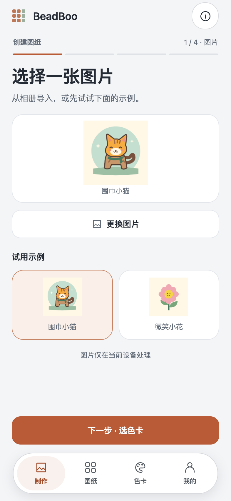
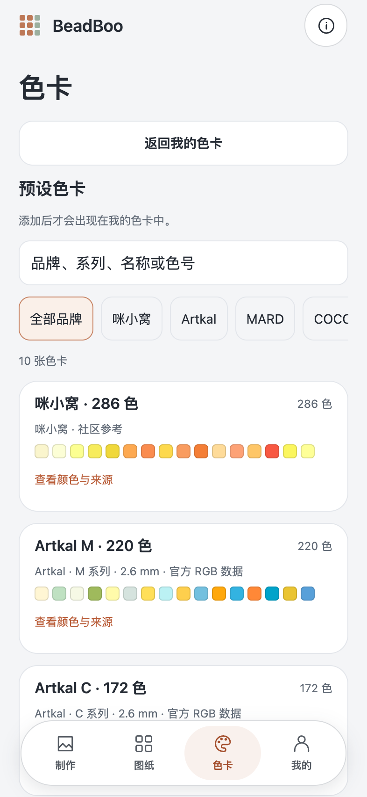
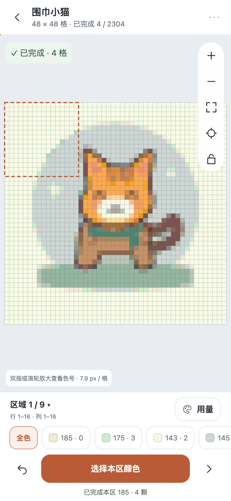

<p align="center">
  
</p>

<h1 align="center">BeadBoo</h1>

<p align="center">
  <strong>把喜欢的图片变成拼豆图纸，记录每一格进度。</strong><br>
  A local-first bead pattern maker and progress tracker.
</p>

<p align="center">
  <a href="CHANGELOG.md"></a>
  <a href="docs/DEPLOYMENT.md"></a>
  <a href="#参与贡献"></a>
</p>

<p align="center">
  <a href="#界面预览">界面预览</a> ·
  <a href="#功能亮点">功能亮点</a> ·
  <a href="#快速开始">快速开始</a> ·
  <a href="#文档">文档</a> ·
  <a href="https://github.com/Yibael/BeadBoo/issues">反馈问题</a>
</p>

---

BeadBoo 陪你完成从图片到成品的过程：选一张图片，匹配手中的色卡，生成图纸，再按区域和颜色逐步拼制。图片处理和图纸保存都在当前设备完成，无需注册；支持手机浏览器和安装到主屏幕的 PWA。

目前版本为 **`0.1.0-alpha.3`**，界面为简体中文，处于早期迭代阶段。

## 界面预览

<p align="center">
  <a href="docs/images/create.png"></a>
  <a href="docs/images/color-cards.png"></a>
  <a href="docs/images/progress.png"></a>
</p>

<p align="center"><sub>实际移动端界面：导入图片 → 选择色卡 → 记录进度。点击图片查看原图。</sub></p>

## 功能亮点

| | 可以做什么 |
| --- | --- |
| **图片转图纸** | 导入图片或试用内置示例，按「图片 → 色卡 → 尺寸 → 预览」四步创建。 |
| **匹配你的色卡** | 10 张内置预设，支持品牌与色号搜索，也可复制、筛选或创建自定义色卡。 |
| **决定作品尺寸** | 宽高分别支持 1–512 格，提供常用尺寸、等比放入和居中裁剪。 |
| **一块一块完成** | 拖动、缩放、查看色号；按区域和颜色批量标记完成，支持撤销与进度恢复。 |
| **带走你的作品** | 导出 PNG 预览、带完整色号的 SVG 图纸、CSV 用量表及 JSON 图纸备份。 |
| **随时继续拼制** | 图片在本地处理，图纸在浏览器保存；应用资源缓存完成后可离线使用。 |

色卡涵盖 Artkal、MARD、COCO、漫漫、咪小窝、盼盼及示例配色。各系列的颜色数量、数据来源与缺项见 [色卡说明](COLOR-CARDS.md)。

## 快速开始

需要 **Node.js 22.13+ 的 22.x、24.3+ 的 24.x，或 25+**，以及 **pnpm 10.28.2**。精确版本范围以 [package.json](package.json) 为准。

```sh
git clone https://github.com/Yibael/BeadBoo.git
cd BeadBoo

# 如果通过 Corepack 管理 pnpm，先执行 corepack enable
pnpm install --frozen-lockfile
pnpm run dev
```

打开 **http://localhost:5173** 即可开始。同一 Wi-Fi 下，手机可访问 `http://<电脑局域网 IP>:5173`；使用 `PORT=5174 pnpm run dev` 调整端口。

`pnpm run dev` 会构建后启动，当前不提供热更新。修改代码后需要重新构建并重启服务；已有构建可直接通过 `pnpm start` 启动。

### 第一次使用

1. 在「制作」选择图片，或试试内置的围巾小猫、微笑小花。
2. 添加并选择色卡，设置画布尺寸，预览后点击「创建图纸」。
3. 在图纸中选择工作区域和颜色，照着高亮格子摆豆，完成后批量标记。
4. 下次从「图纸」继续；在「我的」导出 JSON 备份。

首次使用的「我的色卡」为空，需要主动添加预设或创建自定义色卡。

## 常见问题

<details>
<summary><strong>图片和图纸会上传吗？如何备份？</strong></summary>

图片转换与导出都在当前设备完成。图纸和色卡保存在浏览器的 IndexedDB 中，使用事务和双份快照，并检测其他标签页的写入冲突。当前没有登录、云端存储或跨设备同步。

请定期在「我的」导出 JSON 备份，清除网站数据可能删除作品。备份包含图纸、进度及图纸使用的色卡快照，尚未用于图纸的独立色卡不包含在备份中。浏览器与主屏幕 PWA 的存储可能分开，迁移时请使用备份。

</details>

<details>
<summary><strong>可以像 App 一样安装、离线使用吗？</strong></summary>

可以。将应用部署到 HTTPS 站点后，在 iPhone Safari 选择「分享 → 添加到主屏幕」。首次联网加载后，等待「我的」显示「离线资源已就绪」，即可离线打开已缓存应用和本地图纸。

桌面 `localhost` 可用于 Service Worker 调试；局域网 HTTP 地址仅用于普通页面预览。新版本就绪时，可在「我的」确认更新。当前没有已发布的原生安装包，也未配置公开在线演示。

部署步骤见 [部署指南](docs/DEPLOYMENT.md)。

</details>

<details>
<summary><strong>预览颜色能对应实物吗？色卡更新会影响旧图纸吗？</strong></summary>

参考 RGB 用于屏幕预览和颜色匹配，实体颜色请按品牌、系列与批次辨认。部分预设来自社区整理，不能视为品牌官方标准；示例 D 系列色号不对应实体品牌产品。

已保存图纸保留独立的色卡快照，不会因预设更新或自定义色卡修改而自动改变。

</details>

## 文档

| 文档 | 内容 |
| --- | --- |
| [开发指南](docs/DEVELOPMENT.md) | 技术栈、目录结构、开发命令、单元测试与浏览器测试 |
| [部署指南](docs/DEPLOYMENT.md) | 静态托管、HTTPS、PWA 安装与更新、本地证书配置 |
| [色卡说明](COLOR-CARDS.md) | 数据来源、颜色数量、参考边界与数据源接口 |
| [验证记录](VALIDATION.md) | 已完成的检查及仍需真机验收的项目 |
| [变更记录](CHANGELOG.md) | 版本变化 |

## 参与贡献

欢迎提交 [Issue](https://github.com/Yibael/BeadBoo/issues) 或 Pull Request。报告问题时，请附上设备和浏览器信息、复现步骤以及预期和实际结果。

- 提交前运行 `pnpm run typecheck`、`pnpm test` 和 `pnpm run build`。
- 界面改动请附手机尺寸截图；涉及创建、存储或画布交互时，请运行相关端到端验证。
- 色卡改动请附数据来源、许可与排除项，保持品牌官方数据和社区参考数据的区分。

详细命令与项目结构见 [开发指南](docs/DEVELOPMENT.md)。

## 致谢与许可

沿用项目原有的九宫格拼豆图标。感谢 Artkal 公开颜色参考表，以及 [HansBug / pindou-color-data](https://github.com/HansBug/pindou-color-data) 的社区整理。

本项目目前**暂未添加项目级开源许可证**。第三方色卡数据保留其独立许可与版权声明，详见 [数据许可](licenses/pindou-color-data/LICENSE.txt) 和 [来源记录](licenses/)；该数据许可不代表本项目整体的许可。
